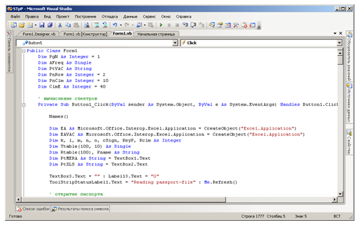
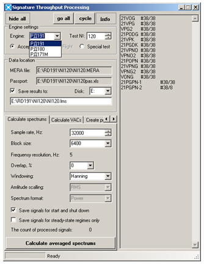

## Управляющая программа пост-обработки динамических параметров ракетных двигателей
### (стационарные режимы)

Программа написана на языке VisualBasic.Net (VS 2008). Предназначена для пост-обработки динамических параметров, записанных как при наземных испытаниях так и при лётных испытаниях ракетных двигателей. 

Чтение и обработка записанных параметров производится через интерфейс программы Test.Lab (LMS).
Вычисленные характеристики сохраняются в таблицах Excel, для последующей статистической обработки.

Пост-обработка результатов испытаний возможна как по одному испытанию, так и пакетом.

Пример кода на рисунке. 

Интерфейс управляющей программы.

